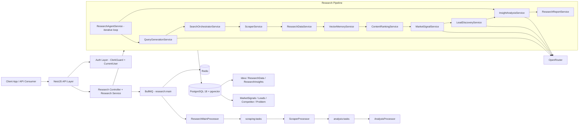
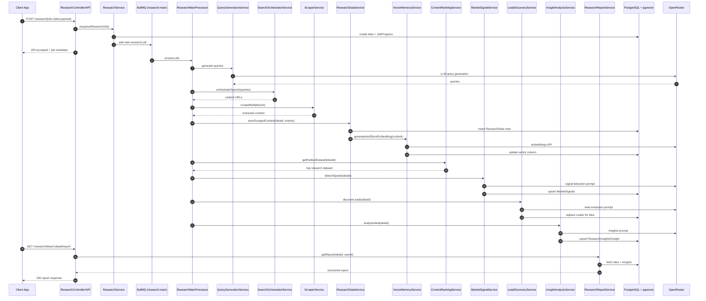

# FounderSignal Server

FounderSignal Server is a NestJS backend that helps founders validate startup ideas through automated market research, signal detection, lead discovery, and AI-driven reporting.

## What This System Does

- Accepts startup ideas and runs asynchronous research jobs
- Collects and stores research content from web/discussion sources
- Builds vector memory with pgvector for semantic similarity workflows
- Ranks and filters noisy content before LLM analysis
- Detects market signals and opportunity areas
- Discovers potential leads and companies from signal-driven queries
- Generates insight summaries and structured reports

## High-Level System Design (HLD)

## End-to-End Research Sequence

## Core Modules

- Auth: Clerk integration with guards and current-user decorator
- OpenRouter: centralized LLM/AI access wrapper
- Queue: BullMQ queues and processors
- Research: end-to-end pipeline services and orchestrators
- Prisma: database client and schema access

## Tech Stack

- Framework: NestJS 11 + TypeScript
- Database: PostgreSQL 18 (Docker) + pgvector extension + Prisma
- Queue: Redis + BullMQ
- AI: OpenRouter SDK
- Auth: Clerk

## Local Setup

1. Install dependencies

   pnpm install

2. Start infrastructure (Postgres + Redis)

   pnpm run db:up

3. Generate Prisma client

   pnpm run prisma:generate

4. Apply migrations

   pnpm prisma:migrate --name init

5. Start server

   pnpm start:dev

Server base URL: http://localhost:5000

## Docker + pgvector Notes

- Postgres container image is pgvector/pgvector:pg18-trixie
- pgvector extension is enabled via docker/init/01-pgvector.sql
- If your Postgres volume already existed before init scripts were added, run once:

  docker compose exec postgres psql -U postgres -d fundersignal -c "CREATE EXTENSION IF NOT EXISTS vector;"

- Migration order matters for vector columns: extension migration must run before migrations that use vector(1536)

## Useful Commands

- Development

  pnpm start:dev

- Build

  pnpm build

- Tests

  pnpm test
  pnpm test:e2e

- Database

  pnpm prisma:generate
  pnpm prisma:migrate --name <migration_name>
  pnpm prisma:studio
  pnpm exec prisma migrate reset --force

- Infra

  pnpm db:up
  pnpm db:down

## Main Research Endpoints

- POST /research/jobs
- GET /research/jobs/:id
- POST /research/ideas
- GET /research/ideas/:ideaId
- GET /research/ideas/:ideaId/report
- POST /research/test/pipeline
- POST /research/test/queries
- POST /research/test/scraper
- POST /research/test/research-data/store
- POST /research/test/research-data/prepare

## Current Data Models (Prisma)

- User
- Idea
- ResearchData
- Competitor
- Problem
- JobProgress
- Insight
- ResearchLead
- ResearchInsights
- MarketSignals
- Lead

## Notes for Contributors

- Use Nest CLI scaffolding for Nest-supported artifacts
- Keep error handling type-safe (error instanceof Error)
- Preserve fallback behavior in AI-dependent services so pipeline execution continues
- Avoid adding .env.example in this repository (project policy uses .env only)
